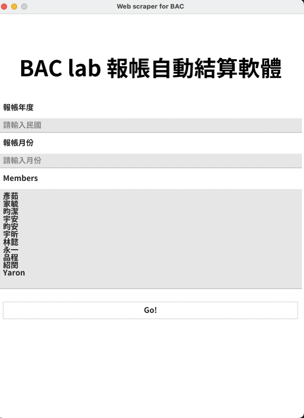

# BAC Lab scraper GUI

Make sure you have Java(v16 up) in your OS environment, if not, go [here](https://oracle.com/java/technologies/javase/jdk18-archive-downloads.html) and select the file depending on what device you use.  
The Scraping.jar is packaged from [web_scraping_Java](https://github.com/iamsad5566/web_scraping_Java), any detail for the scraper is within it.

Step: 
 1. Unzip the bac_scraper.zip
 2. Find the script.command file and double click it.
 3. If everything works as expected, you will see a GUI built by Fyne. All the members of this lab are listed on it, like this:  
  
&nbsp;&nbsp;&nbsp;&nbsp;&nbsp;&nbsp;&nbsp;&nbsp;&nbsp;&nbsp;&nbsp;&nbsp;&nbsp;&nbsp;&nbsp;&nbsp;&nbsp;&nbsp;

 4. Fill in the Year and Month info, adjust the member list. Press the **GO!** button, then just go ahead to have a cup of coffee.
 5. The caculated result would be exported under the root path, which is the `~/bac_scraper` folder.

---

 There's another way to start the program, just use fyne package to package this go program into an application,
 also, remember to drag the Scraping.jar, chromedriver, and config.yml into the application / Contents / Resources folder.
 All you could just contact me, and I will pass it to you directly.